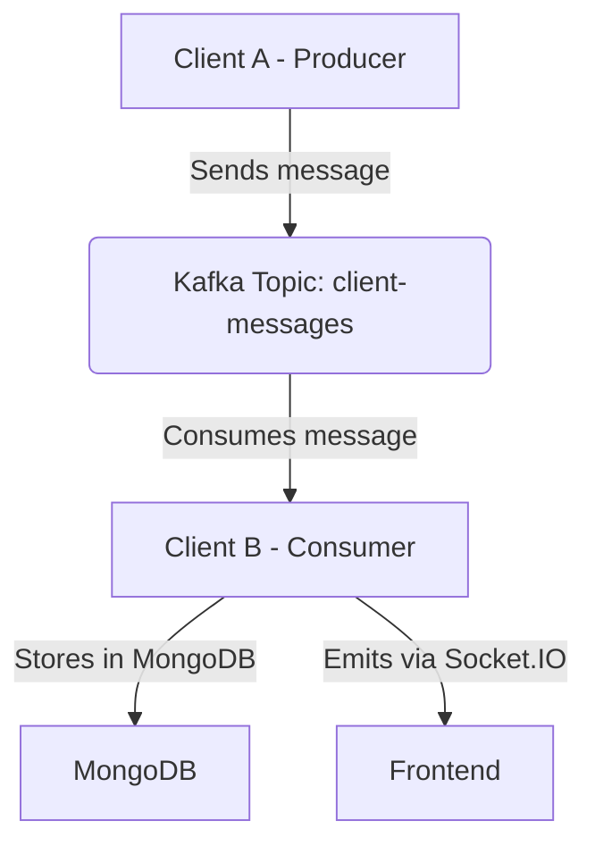

# Kafka-Based Client-to-Client Messaging System using NestJS

## 📌 Overview

This project demonstrates **asynchronous communication between two microservices (Client A and Client B)** using **Kafka** and **NestJS**. The system simulates a simple message-passing architecture where clients communicate through Kafka topics, with real-time updates via Socket.IO.

---

## 🎯 Objective

To implement **event-driven architecture** with **Kafka** in a **NestJS** application. It includes:

- Kafka producer/consumer using `@nestjs/microservices`
- MongoDB integration for message persistence
- Real-time message delivery using **Socket.IO**
- Retry and Dead Letter Queue (DLQ) strategy
- Fully containerized using Docker and Docker Compose

---

## 🏗️ Architecture



---

## 🧩 Services

### 🔹 Client A (Producer)
- Exposes `POST /send-message` endpoint
- Publishes messages to Kafka topic `client-messages`

### 🔸 Client B (Consumer)
- Subscribes to `client-messages`
- Filters messages where `to === 'clientB'`
- Saves filtered messages to MongoDB
- Emits received messages to frontend in real time using **Socket.IO**
- Exposes `GET /messages` to retrieve all stored messages

---

## 📬 Kafka Message Format

```json
{
  "from": "clientA",
  "to": "clientB",
  "message": "Hi there!"
}
```

---

## 🔁 Retry & DLQ Strategy

- **Retry:** Messages are retried using built-in Kafka consumer retry strategy
- **Dead-Letter Queue:** Messages that fail after maximum retries are sent to a separate `dead-letter-topic` for inspection

---

## 🚀 Endpoints

### Service A (Producer)

#### `POST /send-message`

Request Body:

```json
{
  "from": "clientA",
  "to": "clientB",
  "message": "Hi there!"
}
```

---

### Service B (Consumer)

#### `GET /messages`

Returns all messages received and stored by Client B.

---

## 🔌 Real-Time Updates

- Client B uses **Socket.IO** to emit messages in real time to the connected frontend.
- Frontend listens for message events and displays new messages instantly.

---

## 🐳 Docker Setup

### 1. Start Kafka, Zookeeper, and MongoDB

```bash
docker-compose up -d
```

### 2. Run Services

```bash
cd client-a-service
npm install
npm run start:dev
```

```bash
cd client-b-service
npm install
npm run start:dev
```

---

## 🧾 MongoDB

- Used to store all messages received by **Client B**
- Configure MongoDB URI in (MONGOURI) `.env` files for each service

---

## 📹 Video Demo

📺 [Watch the Recorded Demo]()

---

## 📂 Project Structure

```
kafka-nestjs-messaging/
├── client-a-service/
│   ├── src/
│   └── ...
├── client-b-service/
│   ├── src/
│   └── ...
├── docker-compose.yml
└── README.md
```

---


## 🙋‍♂️ Author

- **Name:** [Yadhukrishnan M]
- **Email:** [yadhumon2003@gmail.com]

---

## ✅ Status

✅ Task Completed – As per HR requirements.
